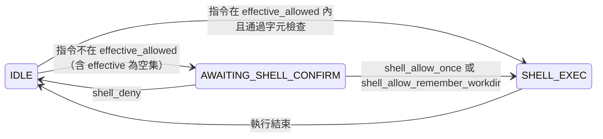

# Shell 指令防護：白名單與使用者確認（Schema 設計）

本文描述 **全域 allowlist（設定檔）**、**依工作目錄（work_dir）的 allowlist（資料庫）**，以及 **指令不在清單時改為詢問使用者** 的資料結構與通訊約定，供後續實作對照。

---

## 1. 目標與層次

| 層次 | 來源 | 用途 |
|------|------|------|
| **A. 全域強制白名單** | `config.yaml` → `shell.allowed_commands` | 伺服器管理者定義「任何 work_dir 都允許」的指令名稱（可選；**空陣列或未列出＝此層不貢獻任何項目至聯集**，不是「不限制任何指令」）。 |
| **B. 工作目錄白名單** | SQLite `shell_workdir_commands` | 依 **正規化後的絕對路徑** `work_dir` 累積「此目錄允許的指令」，可隨使用者「允許並記住」寫入。 |
| **C. 單次確認** | 記憶體 + `sessions` 暫存欄位 | 指令同時不在 **A∪B 的有效集合** 時，不直接拒絕；改為 **詢問使用者**，可選「允許一次」或「允許並加入 B」。 |

**有效允許集合（是否可執行）**：

```text
effective_allowed = normalize_tokens(config.shell.allowed_commands)
                  ∪ rows(shell_workdir_commands where work_dir = session.work_dir_normalized)
```

若第一個指令名稱（正規化後）∈ `effective_allowed` → 直接執行。  
若否 → 進入 **待確認** 狀態（見 §5），不執行直到使用者回覆。

**`effective_allowed` 為空集合時（A 與 B 皆無任何項目）：**  
實作上第一個 token **不可能**屬於空集合，故 **一律** 走「待確認」。這與「未設定白名單就不限制指令」**不同**；請對照 `internal/shell/effective.go` 的 `ClassifyShellLine`。

---

## 2. 工作目錄鍵（work_dir key）

同一邏輯路徑必須對應同一列，避免 `D:\repo` 與 `D:\repo\` 重複。

- 後端在寫入／查詢 DB 前對 Session 的 `work_dir` 做：`filepath.Clean` + `filepath.Abs`（與現有 shell 執行路徑驗證一致）。
- 存成 **UTF-8 字串**；Windows 與 Unix 路徑差異由伺服器單一環境決定，不在此混用。

欄位名：**`work_dir_key`**（TEXT NOT NULL）。

---

## 3. 資料表：`shell_workdir_commands`

記錄「某工作目錄下允許的第一層指令名稱」，與現有 `internal/shell/allowlist.go` 的 **指令正規化**（basename、小寫、去 `.exe` 等）一致。

```sql
CREATE TABLE IF NOT EXISTS shell_workdir_commands (
  id           INTEGER PRIMARY KEY AUTOINCREMENT,
  work_dir_key TEXT    NOT NULL,   -- 正規化絕對路徑
  command      TEXT    NOT NULL,   -- 正規化後的指令名，例如 git、ls
  created_at   TEXT    NOT NULL DEFAULT (datetime('now')),
  UNIQUE (work_dir_key, command)
);

CREATE INDEX IF NOT EXISTS idx_shell_wd_cmd_dir ON shell_workdir_commands (work_dir_key);
```

**語意：**

- 刪除 Session **不**必刪除此表列（work_dir 可能被多個 Session 共用）。
- 若未來要「忘記某目錄下某指令」，可提供 DELETE API 或管理介面（本階段可略）。

---

## 4. `sessions` 表擴充：Shell 待確認暫存

與 `pending_denials` 類似，用於還原 WebSocket 重連後的 UI。

建議 **單一 JSON 欄位**（與現有 `pending_denials` 風格一致）：

| 欄位名 | 型別 | 說明 |
|--------|------|------|
| `shell_pending` | TEXT NOT NULL DEFAULT '' | 空字串表示無待確認；非空為 JSON，見 §4.1。 |

### 4.1 JSON：`shell_pending` payload

```json
{
  "line": "docker ps -a",
  "cmd": "docker",
  "requested_at": "2026-04-18T12:00:00Z"
}
```

| 欄位 | 說明 |
|------|------|
| `line` | 使用者輸入的完整一行（與將要執行的字串相同）。 |
| `cmd` | 正規化後的第一指令名，供 UI 顯示「要允許 docker 嗎」。 |
| `requested_at` | ISO8601，可選，除錯／過期清理用。 |

**狀態欄：** 沿用現有 `sessions.status`，新增枚舉值：

- `awaiting_shell_confirm` — 與 `shell_pending` 非空同時成立。

（若希望少改前端狀態字串，也可在 WS `computeWSState` 僅依 `shell_pending` 非空 回傳 `AWAITING_SHELL_CONFIRM`，DB `status` 同步寫入。）

---

## 5. 設定檔（全域）維持語意

```yaml
shell:
  enabled: true
  timeout: 60s
  max_output_bytes: 524288
  # 全域：永遠合併進 effective_allowed；空陣列表示本層不貢獻任何強制項
  allowed_commands:
    - git
    - ls
```

**與 DB 的關係：**

- `allowed_commands` = **全域** 允許（可為空，表示本層不加入任何名稱）。
- `shell_workdir_commands` = **該 work_dir 額外** 允許。
- 兩者 **聯集** 得到 `effective_allowed`，再判斷直接執行或「詢問」。
- **僅當聯集非空**，且第一個指令名稱落在聯集內，才可能免確認執行；**聯集為空則每道指令都需先確認**。

---

## 6. WebSocket 訊息（建議）

### 6.1 Server → Client

| type | 說明 |
|------|------|
| `shell_command_request` | 需使用者確認時發送。建議 payload：`command`（正規化名）、`line`（完整指令）、可選 `work_dir_key`（僅顯示用，截斷過長路徑）。 |

範例：

```json
{
  "type": "shell_command_request",
  "command": "docker",
  "line": "docker ps -a",
  "work_dir_key": "/home/user/repo"
}
```

### 6.2 Client → Server

| type | 說明 |
|------|------|
| `shell_allow_once` | 允許執行 **本次** `line`（需與伺服器暫存的 `shell_pending.line` 一致，防篡改）。 |
| `shell_allow_remember_workdir` | 將 `cmd` 寫入 `shell_workdir_commands`（當前 session 的 `work_dir_key`），並執行該次 `line`。 |
| `shell_deny` | 清除 `shell_pending`，不執行，回到 IDLE。 |

（命名可與現有 `allow_once` / `set_mode` 並列，避免混淆。）

---

## 7. 狀態機（摘要）



**與現有 `THINKING` / `AWAITING_CONFIRM`（Claude 工具）** 互斥：同一 session 同一時間只應有一種「待處理」類型；實作時宜在進入 shell 確認前 `taskCancel` agent 任務或反之。

---

## 8. 與現有 `ValidateAllowlist` 的關係（實作階段）

1. 計算 `effective_allowed = union(global, db_for_work_dir)`。
2. 若指令（第一 token）∈ `effective_allowed` → 維持現有 `containsShellChainingOrSubstitution` 檢查後執行。
3. 若否 → **不**再直接 `error`；改為寫入 `shell_pending`、廣播 `shell_command_request`、`status: AWAITING_SHELL_CONFIRM`。
4. 使用者回覆後再執行 `shell.Run`，並清除 `shell_pending`。

---

## 9. 索引與遷移

- 新增表 `shell_workdir_commands`、新增欄位 `sessions.shell_pending`（`ALTER TABLE`）。
- 既有 DB 用現有 `migrate()` 模式追加即可。

---

## 10. 安全備註

- 白名單只約束「第一個指令名稱」；`git` 仍可能觸發危險子命令，與現況相同。
- 串接字元阻擋（`&&`、`|` 等）在 **待確認通過後執行前** 仍應再檢查一次，避免儲存的 `line` 被替換攻擊（若全程只信任伺服器暫存則可略）。
- `work_dir_key` 必須與執行 `shell.Run` 時使用的目錄 **完全一致**，避免透過 Session 竄改目錄繞過。

此文件僅為 **Schema／協定設計**；實作時請再開工作項目依序：migration → repository API → WS handler → 前端對話框。
